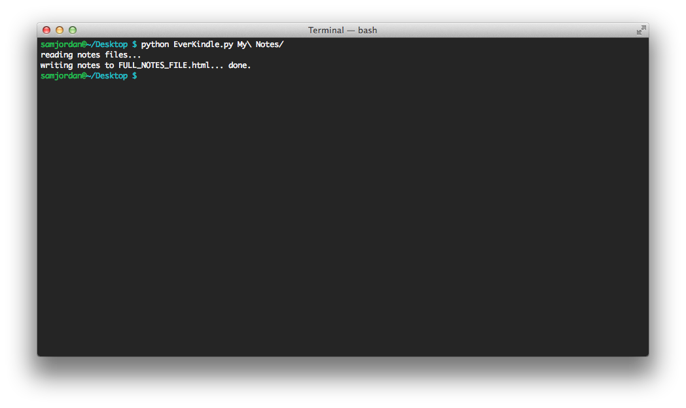

EverKindle
-----
A little script I wrote to convert my evernote notes to a format I can use on my kindle paperwhite.

**REQUIRES NOTES IN EVERNOTE**
1. Export desired notes in Evernote

2. Run EverKindle.py, either from within the directory of your exported notes or by giving it a path to that directory

3. this will create a file called FULL_NOTES_FILE.html within the directory. Full HTML file of your notes.
4. use Calibre or some other software to convert to .azw3 if desired, generate Table of Contents from main headings (Calibre has a 'smarten punctuation' tool too, which is useful).
5. send to kindle!